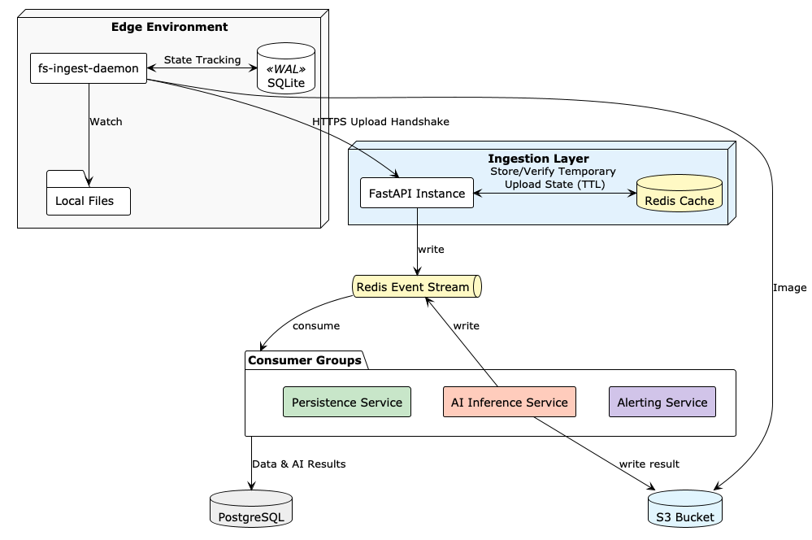

# Glitch Hunt Ingestion API

Building the API for a zero-dependency, resilient data bridge that transforms local file-system events into structured cloud data.

## Project Mission
To provide a robust and scalable bridge between edge environments and cloud storage/analytics, ensuring data integrity and asynchronous processing through an event-driven architecture with an ephemeral handshake.

## Architecture Overview

The system is designed with a layered approach to ensure resilience and scalability:

### 1. Edge Environment (The Source)
- **fs-ingest-daemon**: A lightweight daemon that watches for local file system events.
- **SQLite (WAL)**: Used for local state tracking to ensure no files are missed or processed twice, even after restarts.
- **Local Files**: The raw data source at the edge.

### 2. Ingestion Layer (The Gateway)
- **FastAPI Instance**: The primary entry point for the edge daemons. It manages the "Handshake" protocol.
- **Redis Cache**: Stores temporary upload states and metadata with a TTL (Time-To-Live), ensuring the ingestion process is stateless and resilient.

### 3. Redis Event Stream (The Nervous System)
- Acts as an asynchronous message bus, decoupling the ingestion process from downstream processing. This ensures high availability and allows for backpressure management.
- **Versioned Envelope Schema**: All events follow a standardized envelope to ensure cross-service compatibility:

| Field | Type | Description |
| :--- | :--- | :--- |
| `event_type` | string | e.g., `file.ingested`, `ai.completed`, ... |
| `handshake_id` | uuid | Unique ID linking edge files to cloud records |
| `payload` | json | Domain-specific data (metadata, AI scores, etc.) |
| `version` | json | Version of the FastAPI to prevent fuck ups |

### 4. Consumer Groups (Logic & Enrichment)
- **Persistence Service**: Consumes events from the stream and stores structured data into PostgreSQL.
- **AI Inference Service**: Performs real-time analysis on the ingested data, writing results back to the stream and updating S3 assets.
- **Alerting Service**: Monitors the stream for specific conditions and triggers notifications.

### 5. Storage Cloud
- **S3 Bucket (MinIO)**: Permanent storage for binary data (images, etc.).
- **PostgreSQL**: Permanent storage for structured data and AI inference results.

## Key Workflows

### Ingestion Handshake
The ingestion process uses a two-step handshake to ensure data is safely transferred:

1.  **Request (`POST /v1/ingest/request`)**: The edge daemon requests an upload. The API validates metadata, generates a `correlation_id`, and provides a pre-signed S3 URL.
2.  **Confirm (`POST /v1/ingest/confirm`)**: Once the upload to S3 is complete, the edge daemon confirms the status. This triggers downstream processing via the Redis Event Stream and allows the edge to prune the local file.

## Tech Stack
- **Language**: Python 3.12+
- **Framework**: FastAPI
- **Package Manager**: uv
- **Cache/Stream**: Redis
- **Database**: PostgreSQL
- **Object Storage**: MinIO (S3 compatible)
